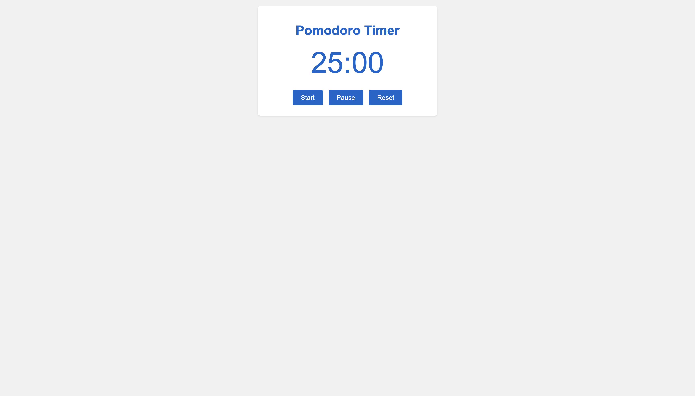

#Pomodoro Timer
### A Simple and Intuitive Productivity Tool  

---



---

###Description

A simple pomodoro timer that can be used to track your work hours. It was created using HTML, CSS, and JavaScript. 

###Features

- Tracks work hours
- Start, stop, and reset the timer

Pomodoro Timer
Version: 1.0

```
Options:
1. Start
2. Stop
3. Reset
```

###Technologies Used
- HTML5
- CSS3
- JavaScript

###Future Plans
- Add a break feature
- Add a settings page
- Add a dark mode
- Add a task manager
- Make the code more efficient and cleaner

